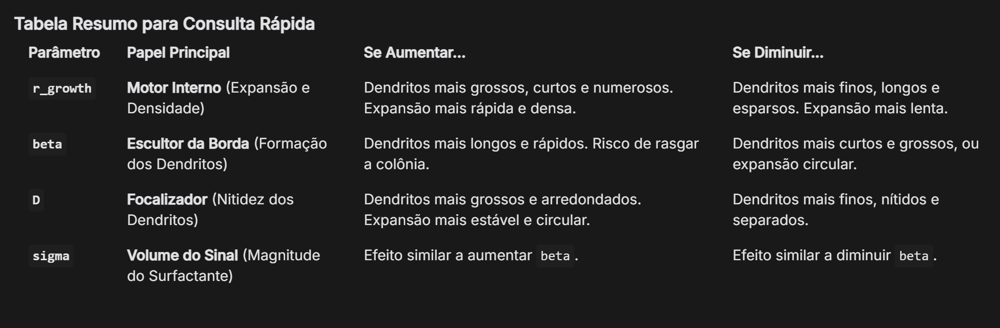

# Equações:

$\rho \frac{Dv}{Dt}=- \nabla p + \mu \nabla^2v+\vec{f}_{Marangoni}+\vec{f}_{osm}+\vec{f}_{flag}$

$\gamma(c_s)=\gamma_0-\beta c_s$

$\vec{f}_{Marangoni}=\nabla\gamma=\nabla(\gamma_0-\beta c_s)$

Como γ₀ é constante (∇γ₀ = 0), a derivada se aplica apenas ao termo $c_s$:

$\vec{f}_{Marangoni}=-\beta\nabla c_s$

$\frac{dc_s}{dt} = \sigma \rho_b + D \nabla^2 c_s - \lambda c_s$ => $\frac{Dc_s}{Dt} = \frac{dc_s}{dt} + \nabla \cdot (vc_s) = \sigma \rho_b + D \nabla^2 c_s - \lambda c_s$

$\frac{d\rho_b}{dt} = r \rho_b \left(1 - \frac{\rho_b}{\rho_{\text{max}}} \right)$

# Rodando o PySPH

## Instalando as dependências
conda create -n pysph_env python=3.10 numpy scipy matplotlib -c conda-forge

conda activate pysph_env

conda install pysph cython mako -c conda-forge

pip install PySPH

conda install mayavi -c conda-forge

conda install mpi4py -c conda-forge

## Rodando a simulação

make run

## Visualizando

make view

## Tabela de parâmetros

