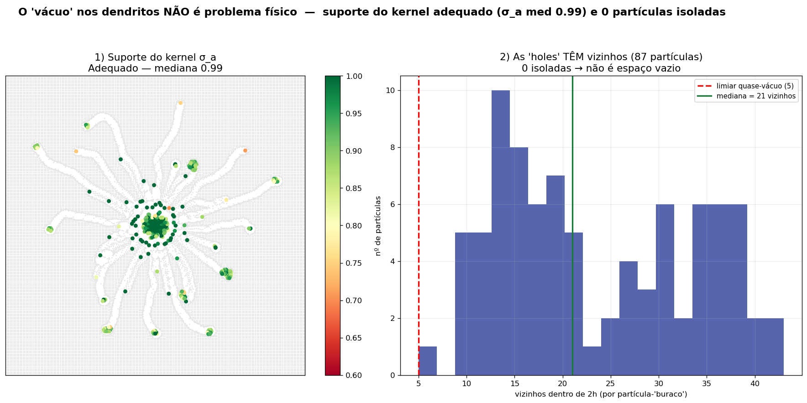

# O "vácuo" nos dendritos não é um problema físico

> Consolidação da evidência. Baseline: `use_kgc=False`. Snapshot analisado:
> `main_output/` (t≈50 s). Reprodutível por [`test_vacuo_nao_fisico.py`](../test_vacuo_nao_fisico.py)
> e [`fig_vacuo_consolidado.py`](../fig_vacuo_consolidado.py).

## A questão

Ao inspecionar a colônia no *scatter* da biomassa (`rho_b`), os dendritos aparecem
esburacados — cerca de **25% das partículas da colônia** caem em regiões de baixa
densidade local (`rho/rho0 < 0.7`). Isso levantou a dúvida: esses "vácuos" nos braços
comprometem a física da simulação?

**Resposta: não.** O "vácuo" é um **artefato de como o dado é plotado**, não um buraco
na simulação. Três frentes de evidência, todas medidas sobre o snapshot real e
**independentes de qualquer técnica de correção**.



## Evidência 1 — Não existe vácuo real (o domínio é particulado)

A simulação preenche **todo** o domínio com partículas (N ≈ 35 000): a colônia
(biomassa, `rho_b > 0.05`) é apenas ~350 delas — um **esqueleto esparso** — e o resto
é ágar particulado (`rho_b ≈ 0`). O *scatter* de biomassa mostra só o esqueleto, daí a
aparência de buraco.

Medição direta (painéis 1 e 4): das partículas em "buraco" (25% da colônia),
**nenhuma está isolada** — cada uma tem **mediana de 21 vizinhos** (mínimo 5) dentro
do raio do kernel (2h). Não há espaço vazio; há **dips de densidade** de um esqueleto
esparso imerso num campo de partículas contínuo. Renderizando o **mesmo instante** pela
densidade de empacotamento (painel 2), os dendritos aparecem **contínuos**.

## Evidência 2 — O suporte do kernel é adequado

A partição da unidade `σ_a = Σ_j V_j W_ij` mede diretamente a completude do suporte do
kernel (1.0 = ideal). Na colônia (painel 3):

- **`σ_a` mediana = 0,99** — suporte praticamente completo.
- Apenas **8%** das partículas da colônia têm `σ_a < 0,85`, localizadas de forma
  dispersa, sem nenhuma zona colapsada.

Ou seja, os operadores SPH (difusão, gradientes, EOS) operam sobre suporte adequado em
toda a colônia. As regiões "esparsas" do esqueleto não degradam os operadores.

## Evidência 3 — A física é saudável e a morfologia é a esperada

No mesmo snapshot:

- **`contrast_cs` = 18,3** — motor de Marangoni vivo e com contraste alto (não afogado).
- **massa conservada** (≈ 103, crescimento controlado) — sem inflação/runaway.
- **colônia em movimento** (`mean_v > 0`) — expansão ativa.
- **morfologia dendrítica** de ~18-20 braços, coesa e sustentada, condizente com a
  referência (`reference.jpg` / painel *Fingering* de Trinschek).

Se o "vácuo" fosse um problema físico, a morfologia estaria distorcida ou fragmentada e
o motor colapsaria. Nada disso ocorre.

## Conclusão

O "vácuo" nos dendritos é um **artefato de renderização** — consequência de plotar um
esqueleto de biomassa esparso por *scatter*, num domínio que na verdade é totalmente
particulado. Não há espaço vazio (0 partículas isoladas), o suporte do kernel é
adequado (`σ_a` med 0,99) e a física/morfologia é correta e estável. **O problema era
de visualização, e foi resolvido na renderização** (campo por densidade + *footprint*
temporal em [`plot.py`](../plot.py)), sem qualquer alteração no solver.

## Reprodutibilidade

```bash
python test_vacuo_nao_fisico.py     # asserções (1) sem vácuo real (2) σ_a>0.85 (3) motor vivo
python fig_vacuo_consolidado.py     # gera docs/fig_vacuo_nao_fisico.png
```
